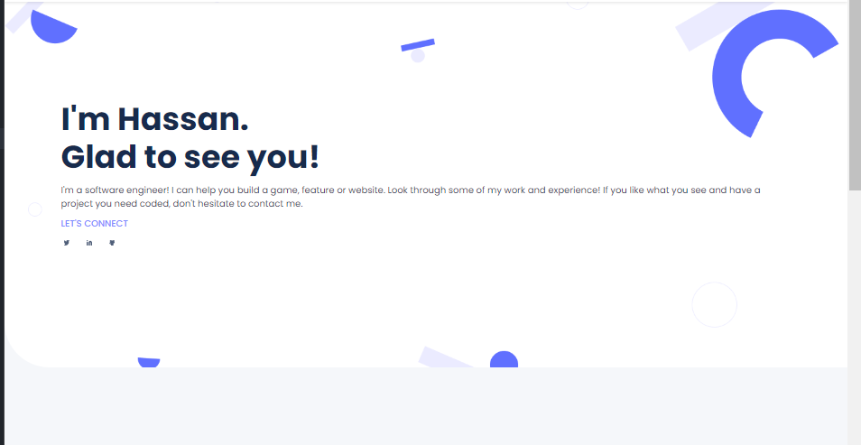
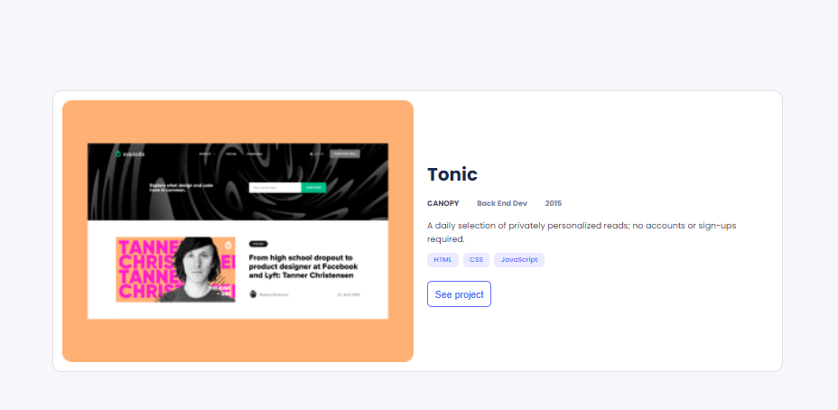
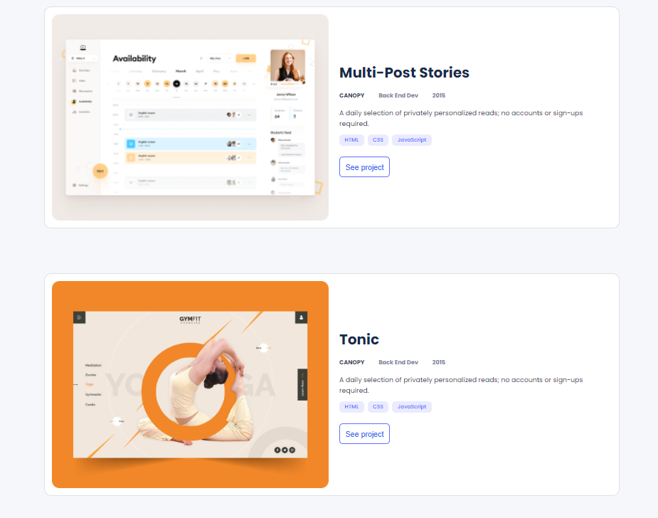
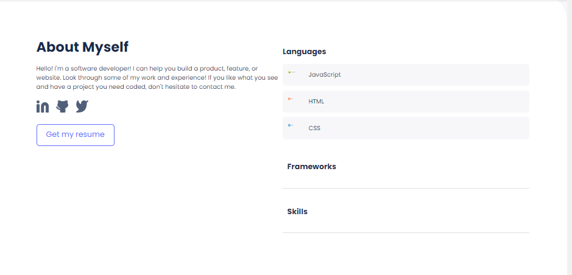
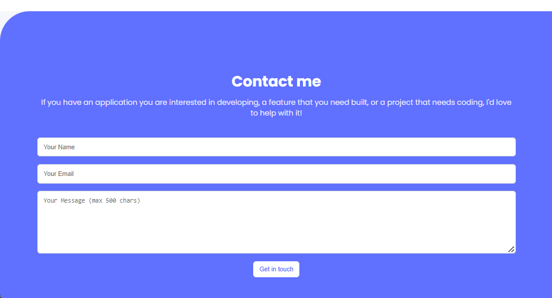

# Portfolio

This is a portfolio project developed during my Web Technologies course. The project consists of HTML and CSS only and showcases various design and layout techniques to create a responsive portfolio website.

## Features
- **Responsive Design:** The portfolio adapts to different screen sizes, providing an optimal viewing experience on both desktop and mobile devices.
- **HTML & CSS:** This project is built using fundamental web technologies without any JavaScript or frameworks.
- **Clean and Modern UI:** Focuses on a visually appealing and modern user interface.

## Screenshots

### Screenshot 1


### Screenshot 2


### Screenshot 3


### Screenshot 4


### Screenshot 5



## How to Use

1. Clone this repository:
   ```bash
   git clone https://github.com/your-username/portfolio-project.git
2. Navigate to the project directory:
     ```bash
    cd portfolio-project
3. Open the index.html file in your browser to view the portfolio:
     ```bash
     open index.html
## License
This project is licensed under the MIT License.


